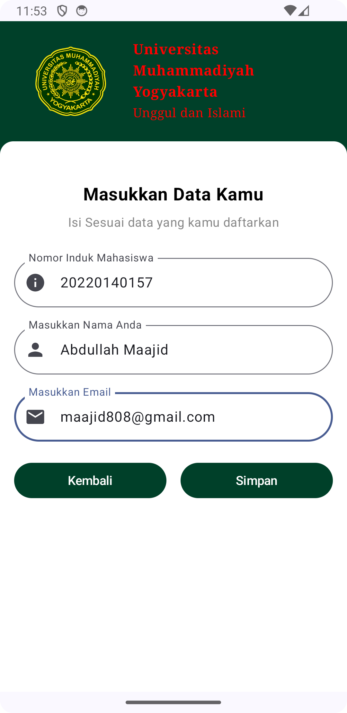
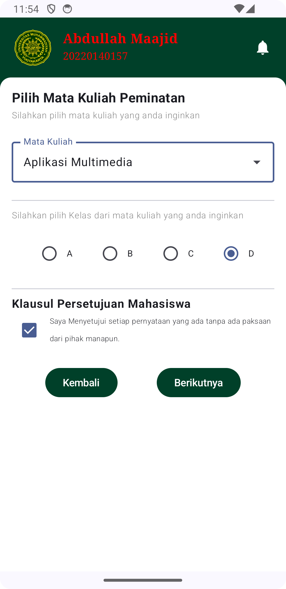
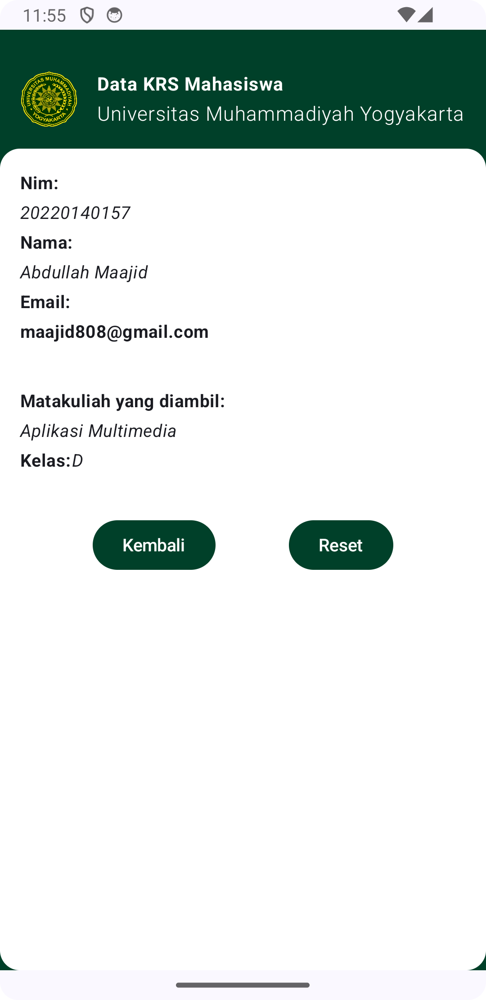

## 1. Splash Screen

Halaman awal aplikasi yang menunjukkan gambar splash dengan tampilan yang menarik.

---

## 2. Formulir Data Mahasiswa

Setelah splash screen, pengguna akan dibawa ke halaman untuk mengisi data mahasiswa. Formulir ini memungkinkan pengguna untuk memasukkan informasi pribadi mereka seperti NIM, nama, dan email.

---

## 3. Formulir Peminatan

Setelah mengisi data mahasiswa, pengguna akan diarahkan ke halaman formulir peminatan untuk memilih mata kuliah yang ingin diambil.

---

## 4. Hasil Pendaftaran

Setelah selesai, pengguna akan melihat halaman hasil pendaftaran yang berisi informasi mengenai mata kuliah yang dipilih dan status pendaftarannya.

---

Terima kasih telah menggunakan aplikasi ini! Kami harap aplikasi ini dapat membantu mempermudah proses navigasi data mahasiswa Anda.
